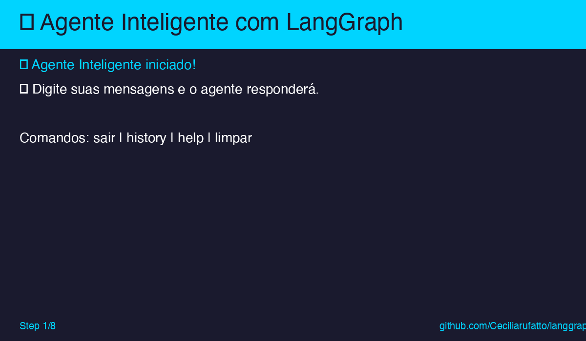
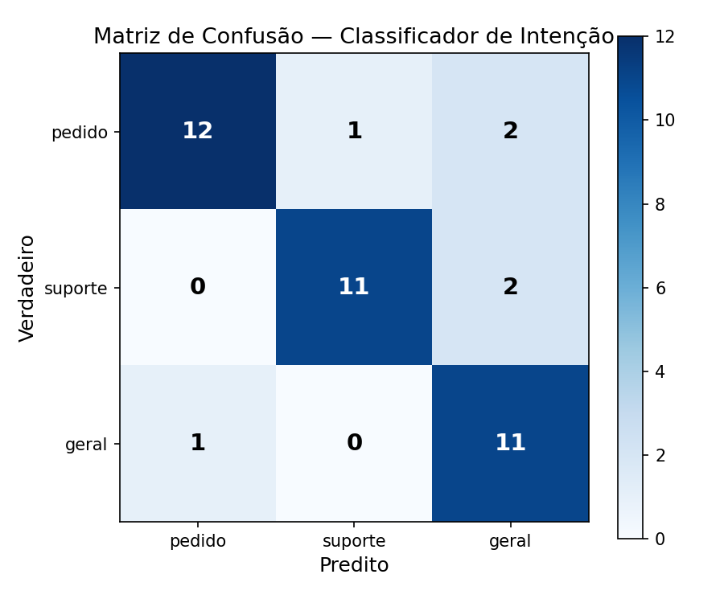
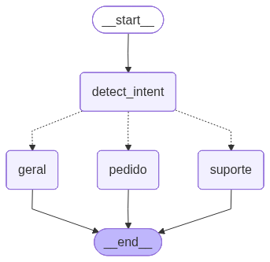

# 🤖 Agente Inteligente com LangGraph

Protótipo de agente de atendimento inteligente desenvolvido utilizando **LangGraph** e **Python**, com orquestração baseada em grafos para simular um sistema de suporte ao cliente com múltiplos estados, decisões dinâmicas e persistência de contexto.

## 📋 Objetivo

Este projeto implementa um agente conversacional que:
- **Analisa a intenção** do usuário (pedido, suporte técnico, consulta geral)
- **Decide qual caminho seguir** através de um fluxo em grafo com decisões condicionais
- **Responde baseado no estado atual** mantendo estado interno e contexto
- **Salva e carrega contexto** da conversa para continuidade

## 🚀 Como Executar

Pré-requisitos:
- Python 3.9 ou superior
- pip

```bash
git clone https://github.com/Ceciliarufatto/langgraph.git
cd langgraph
python -m venv venv
source venv/bin/activate        # macOS/Linux
# venv\Scripts\activate      # Windows
pip install -r requirements.txt
python main.py
```

## 🎬 Demo em Ação



**Demonstração:** Sistema processando diferentes tipos de mensagens, detectando intenção e roteando para handlers apropriados.

## 💬 Exemplos de Uso

```
👤 Você: Quero rastrear meu pedido
🤖 Bot: 🛒 Entendi que você quer informações sobre pedido...

👤 Você: Esqueci minha senha
🤖 Bot: 🆘 Entendo que você precisa de suporte técnico...

👤 Você: history
📜 Histórico da Conversa:
   1. Quero rastrear meu pedido
   2. Esqueci minha senha

👤 Você: sair
👋 Encerrando... Até logo!
```

## 📊 Estrutura do Projeto

```
langgraph/
├── app/
│   ├── __init__.py              # Inicialização do módulo
│   ├── state.py                 # Definição do estado
│   ├── nodes.py                 # Nós do grafo
│   ├── graph.py                 # Construção do grafo
│   └── memory.py                # Persistência
├── main.py                       # Interface CLI
├── evals.py                      # Suite de avaliação
├── scripts/
│   ├── generate_diagram.py       # Diagrama do StateGraph
│   └── generate_qrcode.py        # QR code do repositório
├── data/
│   ├── eval_dataset.json         # 40 frases rotuladas
│   └── conversation_memory.json  # Persistência da CLI
├── metrics/                       # Artefatos da avaliação
│   ├── metrics.json
│   ├── report.md
│   ├── confusion_matrix.png
│   ├── graph.png
│   └── qrcode_repo.png
├── requirements.txt              # Dependências
├── .env.example                  # Exemplo de env
├── demo_langgraph.gif            # Demonstração animada
├── referencias.md                # Referências em ABNT
└── README.md                     # Este arquivo
```

## Avaliação

Pra reproduzir as métricas:

```bash
python evals.py
```

Os artefatos saem em `metrics/`: `metrics.json`, `report.md` e `confusion_matrix.png`.

### Resultados sobre 40 mensagens rotuladas

| Métrica | Valor |
|---|---|
| Accuracy | 85,00% |
| Macro F1 | 0,8507 |
| Latência média | 33,52 ms |
| Latência P95 | ~56 ms |

Por classe:

| Classe | Precision | Recall | F1 | Suporte |
|--------|-----------|--------|----|---------|
| pedido  | 0,92 | 0,80 | 0,86 | 15 |
| suporte | 0,92 | 0,85 | 0,88 | 13 |
| geral   | 0,73 | 0,92 | 0,81 | 12 |



A classe `geral` é o fallback do classificador, então recebe as frases ambíguas que não bateram em nenhuma keyword das outras classes — daí a precision menor (0,73). Esse trade-off entra na discussão do painel.

## Arquitetura do grafo

Diagrama gerado a partir do `StateGraph` compilado:



Pra regerar:

```bash
python scripts/generate_diagram.py
```

## Repositório

QR code usado no rodapé do painel A1:


Pra apontar pra outra URL:

```bash
python scripts/generate_qrcode.py <URL>
```

## 🔄 Fluxo de Funcionamento

1. **Usuário envia mensagem** → `main.py` invoca o grafo
2. **Detect Intent** → Analisa e classifica a intenção
3. **Route Intent** → Decide qual nó processar
4. **Handler específico** → Processa a solicitação
5. **Memory** → Salva contexto da conversa
6. **Resposta** → Enviada ao usuário

## 👥 Divisão de Responsabilidades

- **Cecilia Rufatto** - Pesquisa bibliográfica e implementação
- **Felipe Proença** - Desenvolvimento do fluxo em LangGraph
- **Leonardo Moino** - Implementação da persistência
- **Leonardo Quartaroli** - Desenvolvimento do fluxo
- **Lorena Scabello** - Documentação e apresentação

## 📚 Referências

Lista completa em padrão ABNT NBR 6023 em [`referencias.md`](referencias.md).

Principais:
1. [LangGraph — Overview and Graph API](https://langchain-ai.github.io/langgraph/)
2. [LangGraph — Persistence and Checkpointers](https://langchain-ai.github.io/langgraph/concepts/persistence/)
3. [LangGraph — Human in the Loop](https://langchain-ai.github.io/langgraph/concepts/human_in_the_loop/)

---

**Desenvolvido com ❤️ por Cecilia Rufatto, Felipe Proença, Leonardo Moino, Leonardo Quartaroli e Lorena Scabello**
